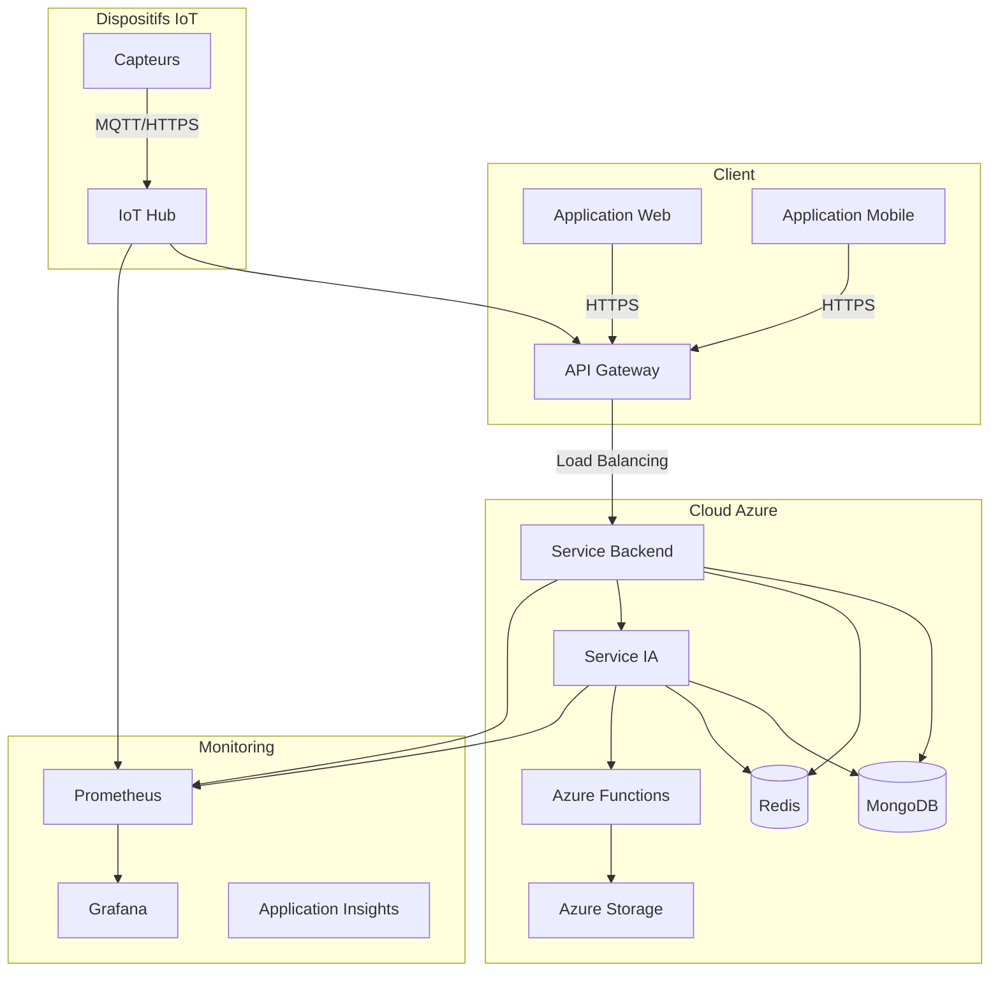
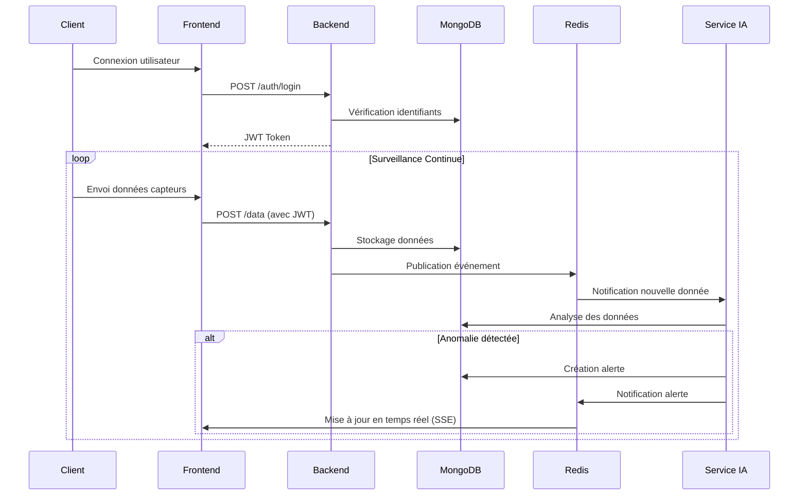
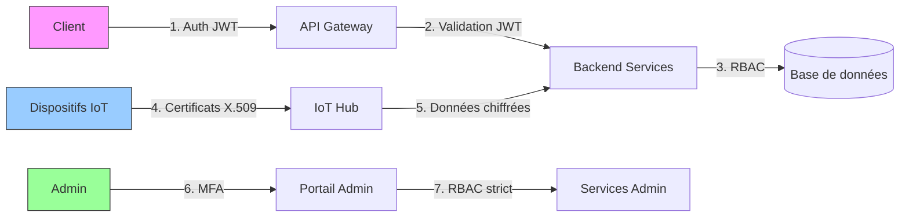
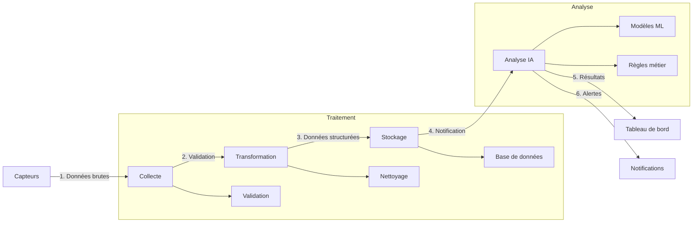

# Architecture du Système

## 1. Diagramme d'Architecture Global



## 2. Diagramme de Déploiement

```mermaid
graph TD
    subgraph Azure[Cloud Azure]
        A[Azure App Service] -->|Conteneur| B[Backend]
        A -->|Conteneur| C[Frontend]
        D[Azure Container Instances] -->|Conteneur| E[Service IA]
        F[Azure Cache for Redis]
        G[Azure Cosmos DB (MongoDB API)]
        H[Azure Storage]
        I[Azure Monitor]
        
        B <--> F
        B <--> G
        E <--> F
        E <--> G
        E <--> H
        
        I -->|Surveillance| A
        I -->|Surveillance| D
        I -->|Surveillance| F
        I -->|Surveillance| G
    end
    
    Client[Client Web/Mobile] -->|HTTPS| A
    IoT[Dispositifs IoT] -->|MQTT/HTTPS| A
```

## 3. Flux de Données



## 4. Architecture de Sécurité



## 5. Flux de Données de Santé



## Légende
- **Lignes pleines** : Flux de données principal
- **Lignes pointillées** : Flux secondaire ou événementiel
- **Rectangles arrondis** : Composants système
- **Parallélogrammes** : Données ou événements
