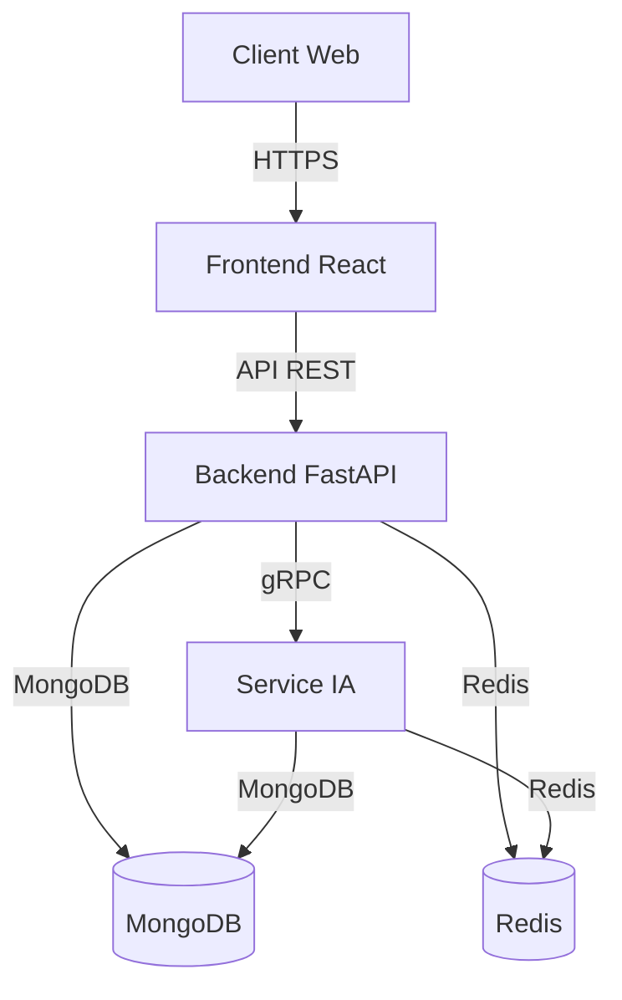

# Architecture du Projet

## Vue d'Ensemble
L'application suit une architecture microservices avec les composants principaux suivants :

1. **Frontend** : Application React.js avec TypeScript
2. **Backend API** : Service FastAPI principal
3. **Service IA** : Microservice d'analyse et de recommandation
4. **Base de données** : MongoDB pour le stockage des données
5. **Cache** : Redis pour la gestion des sessions et le cache
6. **Sécurité** : JWT pour l'authentification, RBAC pour les autorisations

## Diagramme d'Architecture

## Composants Principaux

### Frontend
- Framework : React 18 avec TypeScript
- Gestion d'état : React Context + Redux Toolkit
- UI : Tailwind CSS + Headless UI
- Routing : React Router v6

### Backend
- Framework : FastAPI
- ORM : Beanie pour MongoDB
- Authentification : JWT
- Validation : Pydantic v2

### Service IA
- Framework : FastAPI
- Modèles : Scikit-learn / TensorFlow
- File d'attente : Redis Streams
- Stockage : MongoDB pour la persistance

## Flux de Données
1. Les appareils IoT envoient des données au backend via des API sécurisées
2. Le backend valide et stocke les données dans MongoDB
3. Le service IA traite les données en temps réel via Redis Streams
4. Les alertes et recommandations sont générées et stockées
5. Le frontend affiche les données et alertes en temps réel
